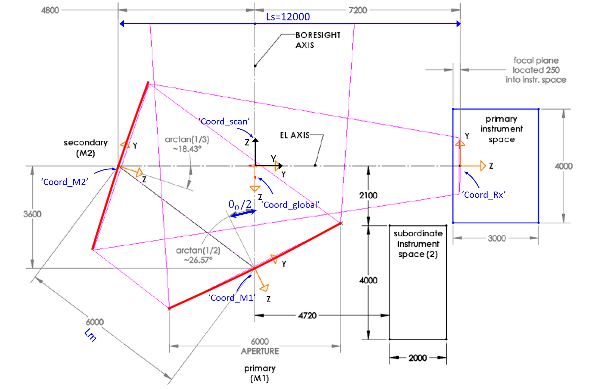
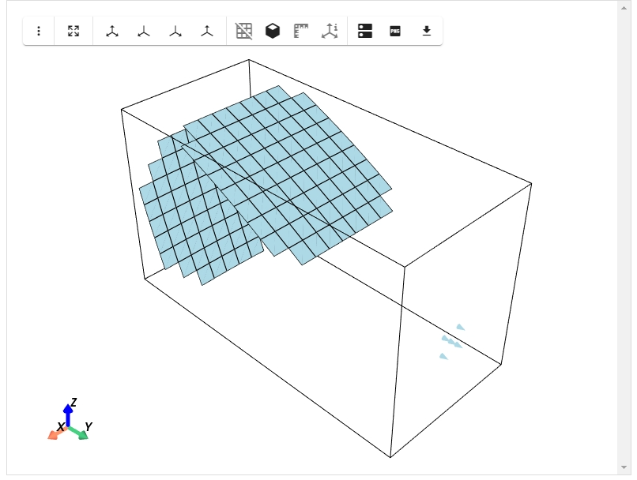
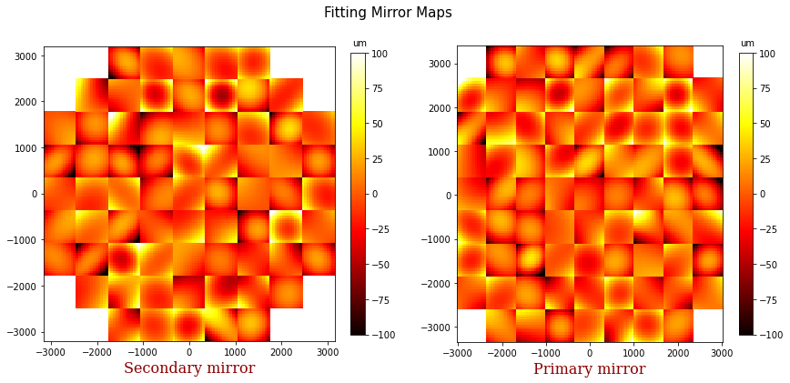

# 'ccat_holo'

'ccat_holo' is a python package which is designed to analyze the holographic measurement data for the Fred Young Sub-mm Telescope. The telescope uses a special 'Crossed-Dragone' optics design, which consists of two 6-m reflectors. Its two reflectors both have to be aligned to be better than 10um (goal of < 7um). 

The new **'Multi-map'** Holography method has been developed for measuring and discriminating the surface errors of the two reflectors of FYST by taking 5 different beam maps. The software was developed for the data analysis which can convert the 5 measured beam maps into 'Two' surface error maps.

1. [Installation](#Installation)
2. [FYST Geometry](#FYST-Geometry)
3. [Coordinate Systems](#Coordinate-Systems)
4. [Configurate the FYST Holography](#Configurate-the-FYST-Holography)
    1. [Set electrical parameters: operating frequency and the holo-Rx beam](#1-set-electrical-parameters-operating-frequency-and-the-holo-rx-beam)
    2. [Define the FYST Holo-model](#2-define-and-initialize-the-fyst-holo-model)
    3. [Start the First Time-cost Beam calculation](#3-start-the-first-time-cost-beam-calculation)
5. [Make the 'Forward' Beam calculation function (Model.FF)](#make-the-forward-beam-calculation-function-modelff)
6. [Data Analysis](#data-analysis)
## Installation
**This package just works with python3.**

Following packages are required:
1. numpy v1.21
2. scipy v1.7
3. pytorch 1.12
4. transforms3d v0.4.1
5. h5py v3.6.0
6. pyvista

You can install these packages using the command:  
```shell
'pip install -r requirements' 
``` 
When you have all required packages, you can clone or download the 'ccat_holo' repository from github or uni-koeln gitlab.  
```shell
git clone https://github.com/XiaodongRencologne/CCAT_holo_V1.git
```
or
```shell
git clone https://github.com/XiaodongRencologne/CCAT_holo_V1.git
```

## FYST Geometry
The details of the FYST geometry (Figure 1) is defined by files in the 'CCAT_model' folder. **For the FYST holographic analysis, you don't need to modifiy anything.**

  
*Figure 1: FYST optical layout and 5 receiver locations.*

Here, we explain the parameters in the files.  
**Mirror surface profile: 'coeffi_m1.txt/coeffi_m2.txt'**
The files record the coefficients of the 2D polynominals which are used to describe the surface profiles of the FYST's two mirrors (M1 and M2). x and y coordinates of the 2D polynomials are normalized by a factor of 3000mm (radius of the FYST's aperture). The two mirror surfaces are defined in their local coordinate systems.   
$$z=\sum_{i,j=0}{c_{ij}{\left({x}\over R\right)}^{i}{\left({y}\over R\right)}^{j}}$$

**Panel positions: 'L_m1.txt and L_m2.txt':**
The files define the panel layout in M1 and M2. They record the list of panel center positions. 

**Sampling number: 'Model.txt':**
The size of the mirror panels (700x710mm on M2 and 670x750mm on M1) and positions of the 4 corner panel adjusters can be set in this file.  The required sampling points on the mirror panels are defined in the file. The sampling range and points in the intermediate focal (IF) plane are also given here. 
|                    |  Size        |  Sampling Points  |
| ------------------ |--------------| ----------------- |
| M2                 | 700x710mm    | 15x15             |
| M1                 | 670x750mm    | 14x14             |
| IF                 | 540x540mm    | 121x121           |

## Coordinate Systems


FYST holography meausrement will measure 5 beam maps by puting the Rx at 5 different points. The receiver mounting points and the cooresponding antenna scanning trajectory must be expressed in the **'coord_Rx'** & **'coord_Scan'** coordinate systems indicated in below Figure 2.

In the practical holographic measurement, The coordinates of the recorded field points need to be converted into the points expressed in the 'coord_scan' frame.

**'Coord_M1' and 'Coord_M2'** are the frames for defining the mirror layout.



*Figure 2. Optical layout of FYST and its coordinate systems.*


## Configurate the FYST Holography
### 1. Set electrical parameters: operating frequency and the holo-Rx beam


The measuring frequency of the holo-system and Guassian beam of the used holo-Rx are given in file 'electrical_parameter.txt'.
|  Parameters        |  Sampling Points  |
|--------------------| ----------------- |
| freq/GHz           | 296               |
| Edge_taper/dB      | -8                |
| taper_angle/deg    | 11.894            |

The Gaussian beam of the receiver is set by the illumination edge taper at a specific taper angle. 

### 2. Define and initialize the FYST Holo-model

All required methods for the FYST holography data analysis are integrated in the class <em>**'CCAT_holo'**<em> in the package <em>**ccat_holo.Pyccat**<em>. Before starting the data analysis, we should first define the FYST holography model correctly. In the following example, I will demonstrate the code about the holo-mode defination. You also can read and run the code in jupyter notebook [Initialization_FYST_holo](examples/1_initialization_FYST_holo.ipynb).


```python
# 0. Import the CCAT_holo model
from ccat_holo.Pyccat import CCAT_holo
import torch as T # import pytorch package
import numpy as np # import numpy package
import h5py
```

<em>**CCAT_holo**<em> requires 3 input parameters. First is the folder 'CCAT_model' defining the [FYST geometry model](#fyst-geometry).  
<em>**Output_folder**<em> is the chosen folder to store the matrixes of the initial beam calculation.  
Then we should define 5 receiver mounting points and their measured field points. These are set by a python dictionary seen below.


```python
# 1. Model folder
Model_folder='CCAT_model'
# 2. Configuration of the Holography system
holo_setup={'Rx1':([0,0,600],'scan/51/on-axis.txt'), 
            'Rx2':([400,400,600],'scan/51/400_400_600.txt'),
            'Rx3':([400,-400,600],'scan/51/400_-400_600.txt'),
            'Rx4':([-400,400,600],'scan/51/-400_400_600.txt'),
            'Rx5':([-400,-400,600],'scan/51/-400_-400_600.txt')
            }
# Define 5 receiver positions in the 'Coord_Rx' system, e.g [+/-400,+/-400,600]
# and their field points that are stored in file 'scan/400_400_600.txt'. The field
# points of the measured beam maps are from the read out of the telescope coders.
#####################
# 3. Output_folder is the folder used to store the intermediate data of the first
#    beam calculation and the analysing results.
Output_folder='Analysis1'

# 4. Create the FYST holography Model and check the telescope model and 
# holographic setup in the 3D view.
Model=CCAT_holo(Model_folder,Output_folder,holo_conf=holo_setup)
```

    FYST telescope model has been created!!
    

- Using the method <em>'Model.view'<em> can show the 3D model of the defined antenna and the pre-defined 5 Receiver points. 


```python
Model.view() # Show 3D FYST model and its receivers.
```




```python
Model.view_Rx(Rx=['Rx1']) # This method can highlight the chosen reciever horns.
```

### 3. Start the First Time-cost Beam calculation
This software package uses fitting algorithm and requires thousands fitting loop to find the best fit panel distortions. To speed up the beam calculation called forward function, we run a 'time-cost' and accurate beam calculation, and save the intermediate values (e.g., complex field values on M1, M2, IF Plane and the desired source region, and the field transfer metrixes between M1, M2 and the spherical face in source) as HDF5 binary data format and store the data in the given <em>**Output_folder**<em>. Combining several linear approximations can significantly reduce computing time by three orders of magnitude.

The first time-cost beam calculation can be done by running the function <em>**Model.First_Beam_cal()**<em>.  

**For one independent holographic measurement, we just need to do the time-cost beam calculation once.** 


```python
# 5. Running the time-consuming first beam calculation.
''' We only need to run this calculation in the beginning
 of the data analysis. All the setup defined in 'holo_config'
 will be computed. The intermediate computed data will be
 stored in the directory 'output_folder', here is 'Analysis1'.
'''
Model.First_Beam_cal()


```

## Make the 'Forward' Beam calculation function (Model.FF)
**Linear approximation**
Because the surface deformations of the two mirrors are much smaller than the operating wavelength (~1mm), we implement linear approximations to speed up the beam computation for the given panel distortions, which assums that the panel distortions only modify the phase of the EM fields on the surfaces of M1 and M2 and the phase changes is linear to the panel offset.


Using the results from the costly first beam computation and the linear approximations, the computing time of one beam prediction can be reduced to <1s. Implementing the advanced GPU technique can further accelerate the calculation. 

<em>**Model.FF**<em> is the created beam forward function with panel adjuster movements as its input parameters.  
<em>**Model.FF(S,Amp_ap, Phase_ap)**<em>: S is the displacement of panel adjusters on M1 and M2, <em>Amp_ap<em> is a list of parameters used to correct the illumination tape of the telescope. And <em>Phase_ap<em> is used to express the field phase difference in aperture between the designed holography model and the practical measurement.

We can build the function <em>**Model.FF**<em> by runing <em>**Model.mk_FF(fitting_param='panel adjusters',Device=T.device('cpu'))**<em>. If <em>Device<em> is set by "T.device('cude:0')" and the Nvidia Graphic card is available, the model can be loaded onto Graphic card for acceleration.


```python
# 6. Make the farward beam calculation function, (Model.FF), with using
# the data produced by the First beam calculations. Here, we can use the movements
# of the panel adjusters or coefficients of Zernike polynomial as the fitting paramters.
# If fitting_param is 'zernike', the surface deviations will be described by 
# the summation of zernike polynimals, and the maximum zernike order is 7th.
Model.mk_FF(fitting_param='panel adjusters',Device=T.device('cpu'))
#Model.mk_FF(fitting_param='panel adjusters',Device=T.device('cuda:0'))

# The function also supports the GPU acceleration by setting the 'Device' to 
# 'T.device('cuda:0')'.

# Model.FF(adjusters, Para_Amp, Para_phase)

```

## Data Analysis
When the Forward Function is built, we can start the mirror surface analysis by using the measured 5 maps. The method uses the numerical optimization algorithm to tune the movements of the panel adjusters (**$S_{M2/M1}$**) which can produce the best fit to the measured beam data. Because of the unavoidable systematic errors in the practical system, for example, antenna pointing error causing phase tilt in aperture and inaccuracy of the source and receiver beam patterns, parameters <em>Amp_ap<em> and <em>Phase_ap<em> also needed to be fitted. 

According to the experience of numerical simulations and the practical laboratory test, processing the fitting in **two steps** can save the inference time and avoid undesired local minimums of the panel adjuster values. 

1. we only find the parameters <em>Amp_ap<em> and <em>Phase_ap<em> (called large-scale parameters hereafter) to estiminate the optical misalignment errors existed in the system. The function in the defined model is '**<em>Model.fit_LP( )<em>**'.  

- <em>**Model.fit_LP(** Meas_maps,Device=T.device('cpu') **)**<em>:  
    **<em>Meas_maps<em>**: the data of the measured 5 beams. Each beam has two raws of data which are real and imaginary of the complex measured fields. So 'Meas_maps' is a tensor with shape of (5x2,Field points number).  
    **<em>Device<em>**: If the Model.FF function is built in the GPU frame, here the parameter '<em>Device<em>' must be consistent to the setup 0f 'Model.FF'.  
    **Results**: The fitted Large-scale parameters are saved in the variable <em>Model. <em>

2. After the large-scale parameters fitting, the found values are used as the initial input for the mirror surface fitting. The used method is '**<em>Model.fit_surface( )<em>**'.  

- <em>**Model.fit_surface(** Meas_maps, constraint=[1,1,1,1,1,1],Device=T.device('cpu'), Init_LP=np.array() **)**<em>:  
    **<em>Init_LP<em>**: The fitting values of large-scale parameters from the first step.  
    **<em>constraint<em>**: The factors of the regularization terms.

Following is the example codes. You also can find the script in jupyter notebook file [Analysis](examples/2_Analysis.ipynb).

**Step 1:**   Read the measured beams and convert it into a torch.tensor.  
For example, the simulated beam maps for the case that surface deviations of the two mirrors are around 30um rms and the inaccuracy of receiver position is <3um.
The script of producing the measured data can be found [here](./Create_Measured_Beams_30umRMS.ipynb).


```python
# 7. fit systematic alignment errors (Large-scale parameters):
'''Meaused data'''
Meas_beam=np.genfromtxt('./Meas_beams/GRASP_296GHz_51_51.txt',delimiter=',')
Meas_beam=T.tensor(Meas_beam)
```

**Step 2:**  Only fit the large-scale parameters that describes the illumination and phase tilt and curvature errors in aperture plane.  

The large-scale phase errors, e.g., tilted and curved parts, in the telescope's aperture plane are caused by the antenna pointing offset and the lateral position errors of the holo-Rx. The errors in the amplitude of the field in aperture are due to the inconsistency between the design source Guassian beam or Rx beam and theire practical Gaussian beams.  

Fitting these parameters first can significanly improve the efficiency of the following fine panel fitting.  

The soluation of the fitting process is storted in a 'h5py' file in the defined output folder of the project. 

After the fitting loops, we can check results in the new object 'Model.fit_LP'.


```python
# 8. Find the large-scale parameters. The fitting results are stored in file 'fit_LP.h5py'
Model.fit_LP(Meas_beam,Device=T.device('cpu'),outputfilename='fit_LP')

# Fitting solution
print(Model.result_LP.x[0:5*6].reshape(5,-1)) # amplitude parameters
print(Model.result_LP.x[5*6:].reshape(5,-1))# fitted aperture phase errors

# Load the results from h5py file
import h5py
with h5py.File(Output_folder+'/fit_LP.h5py','r') as f:
    fit_LP=f['x'][:]
```

Compared the fitted beams to the perfect beam defined in the software model, we can see the pointing errors in the system have been found. 


```python
from ccat_holo.pyplot import plot_beamcontour
Beams_LP=Model.FF(T.zeros(5*(69+77)),
                  fit_LP[0:5*6],
                  fit_LP[5*6:]).numpy()
Beams_ref=Model.FF(T.zeros(5*(69+77)),
                  T.tensor([1,0,0,0,0,0,
                            1,0,0,0,0,0,
                            1,0,0,0,0,0,
                            1,0,0,0,0,0,
                            1,0,0,0,0,0]),
                  T.zeros(5*5)).numpy()
# Blue contour lines represent reference beams.
# Red is the fitted beams for the measured beams. 
x0=np.linspace(-1,1,51)
y0=np.linspace(-1,1,51)
plot_beamcontour(x0,y0,Beams_LP,Beams_ref,
                 levels=[-35,-30,-20,-15],
                 outputfilename=Output_folder+'/beam_comparison_contourPlot_LP.png')
```


    

    


**Step 3:** Find the panel distortions.  
We use the solution of previous rough large-scalar parameters analysis as the initial input of the panel distortion analysis. 


```python
Model.fit_surface(Meas_beam,
                  constraint=[1,1,1,1,1,10],
                  Device=T.device('cpu'),
                  Init_LP=Model.result_LP.x,
                  outputfilename='fit_adjusters')
# 'Meas_beam' is the torch.tensor of the measured beams.
# 'Init_LP' is the solution from the first large-scale aperture analysis. 
# 'constraint' is the multiplier of the regularization terms used in 'loss
# function', which ensures that the phase tilt in aperture is due to systematic 
# pointing errors and not mirror tilt.
```

The solution is stored in a h5py file, for example, here is the file of 'fit_adjusters.h5py'. The data is also represented in the object <em>'Model.result.x'<em>. 

The best fit panel errors can be checked by using the 'ccat_holo.fitting_error_plot' package. 


```python
# read the solution from h5py file
with h5py.File(Output_folder+'/fit_adjusters.h5py','r') as f:
    fit_surface=f['x'][:]
print(fit_surface)
```

<em>array([ 2.05160143e-02, -1.89953992e-03, -1.27582007e-02,  2.03548655e-02, .......  1.30052278e-15,  3.81340137e+00,  3.73738151e+00,  6.16262222e-01, 5.59505359e-01])<em>


```python
from ccat_holo.fitting_error_plot import Fit_M_Surface
# draw the fitted surface panels
Fit_M_Surface(fit_surface,vmax=100,vmin=-100)
```


    

    


```python
# Compare the fitted beams with the measured beams
F_beams=Model.FF(T.tensor(fit_surface[0:5*(69+77)]),
                 T.tensor(fit_surface[5*(69+77):5*(69+77+6)]),
                 T.tensor(fit_surface[5*(69+77+6):])).numpy() # calculated the fitted beams
from ccat_holo.pyplot import plot_beamcontour
# Blue contour lines represent reference beams.
# Red is the fitted beams for the measured beams. 
x0=np.linspace(-1,1,51)
y0=np.linspace(-1,1,51)
plot_beamcontour(x0,y0,F_beams,Meas_beam,
                 levels=range(-40,10,10),
                 outputfilename=Output_folder+'/beam_comparison_contourPlot_detail.png')
```


    

    

