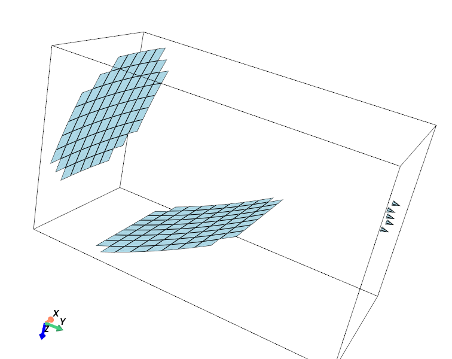

# ccat_holo

'ccat_holo' is a python package which is designed to analyze the holographic measurement data for the Fred Young Sub-mm Telescope. The telescope uses a special 'Crossed-Dragone' optics design, which consists of two 6-m reflectors. Its two reflectors both have to be aligned to be better than 10um (goal of < 7um). 

The new **'Multi-map'** Holography method has been developed for measuring and discriminating the surface errors of the two reflectors of FYST by taking 5 different beam maps. The software was developed for the data analysis which can convert the 5 measured beam maps into 'Two' surface error maps.

- [Installation](#Installation)
- [FYST Geometry](#FYST-Geometry)
- [Coordinate Systems](#Coordinate-Systems)
- [FYST Holography Configuration](#Configurate-the-FYST-Holographic-System)

- [Configuration of the FYST Holography System]

## Installation
**This package just works with python3.**

Following packages are required:
1. numpy v1.21
2. scipy v1.7
3. pytorch 1.12
4. transforms3d v0.4.1
5. h5py v3.6.0
6. pyvista

You can install these packages using the command:

'pip install -r requirements'

When you have all required packages, you can clone or download the 'ccat_holo' repository from github or uni-koeln gitlab. 

```shell
git clone https://github.com/XiaodongRencologne/CCAT_holo_V1.git
```
or
```shell
git clone https://github.com/XiaodongRencologne/CCAT_holo_V1.git
```

## FYST Geometry
The details of the FYST geometry (Figure 1) is defined by files in the 'CCAT_model' folder. **For the FYST holographic analysis, you don't need to modifiy anything.**



*Figure 1: FYST optical layout and 5 receiver locations.*

Here, we explain the meaning of each files.

**Mirror surface profile: 'coeffi_m1.txt/coeffi_m2.txt'**
The files record the coefficients of the 2D polynominals which are used to describe the surface profiles of the FYST's two mirrors (M1 and M2). x and y coordinates of the 2D polynomials are normalized by a factor of 3000mm (radius of the FYST's aperture). The two mirror surfaces are defined in their local coordinate systems. 
$$ z=\sum_{i,j=0}{c_{ij}{\left({x}\over R\right)}^{i}{\left({y}\over R\right)}^{j}}$$

**Panel positions: 'L_m1.txt and L_m2.txt':**
The files define the panel layout in M1 and M2. They record the list of panel center positions. 

**Sampling number: 'Model.txt':**
The size of the mirror panels (700x710mm on M2 and 670x750mm on M1) and positions of the 4 corner panel adjusters can be set in this file.  The required sampling points on the mirror panels are defined in the file. The sampling range and points in the intermediate focal (IF) plane are also given here. 
|                    |  Size        |  Sampling Points  |
| ------------------ |--------------| ----------------- |
| M2                 | 700x710mm    | 15x15             |
| M1                 | 670x750mm    | 14x14             |
| IF                 | 540x540mm    | 121x121           |

## Coordinate Systems

FYST holography meausrement will measure 5 beam maps by puting the Rx at 5 different points. The receiver mounting points and the cooresponding antenna scanning trajectory must be expressed in the **'coord_Rx'** & **'coord_Scan'** coordinate systems indicated in below Figure 2.

In the practical holographic measurement, The coordinates of the recorded field points need to be converted into the points expressed in the 'coord_scan' frame.

**'Coord_M1' and 'Coord_M2'** are the frames for defining the mirror layout.


*Figure 2. Optical layout of FYST and its coordinate systems.*

## Configurate the FYST Holographic System

**Set Electrical parameters**

The measuring frequency of the holo-system and Guassian beam of the used holo-Rx are given in file 'electrical_parameter.txt'.
|  Parameters        |  Sampling Points  |
|--------------------| ----------------- |
| freq/GHz           | 296               |
| Edge_taper/dB      | -8                |
| taper_angle/deg    | 11.894            |

The Gaussian beam of the receiver is set by the illumination edge taper at a specific taper angle. 

****


## Initialization and Holography configuration

'CCAT_holo' is the basic tool developed to 


**x**


```python
from ccat_holo.Pyccat import CCAT_holo
import time
import torch as T
```


```python
# 1. Model folder
Model_folder='CCAT_model'
# 2. Configuration of the Holography system
holo_setup={'Rx1':([0,0,600],'scan/on-axis.txt'), 
            'Rx2':([400,400,600],'scan/400_400_600.txt'),
            'Rx3':([400,-400,600],'scan/400_-400_600.txt'),
            'Rx4':([-400,400,600],'scan/-400_400_600.txt'),
            'Rx5':([-400,-400,600],'scan/-400_-400_600.txt')
            }
# Define 5 receiver positions in the 'Coord_Rx' system, e.g [+/-400,+/-400,600]
# and their field points that are stored in file 'scan/400_400_600.txt'. The field
# points of the measured beam maps are from the read out of the telescope coders.
#####################
# 3. Output_folder is the folder used to store the intermediate data of the first
#    beam calculation and the analysing results.
Output_folder='Analysis1'

# 4. Create the FYST holography Model and check the telescope model and 
# holographic setup in the 3D view.
Model=CCAT_holo(Model_folder,Output_folder,holo_conf=holo_setup)
Model.view()

#Model.view_Rx(Rx=['Rx1'])
```


```python
# 5. Running the time-consuming first beam calculation.
Model.First_Beam_cal()
''' We only need to run this calculation in the beginning
 of the data analysis. All the setup defined in 'holo_config'
 will be computed. The intermediate computed data will be
 stored in the directory 'output_folder', here is 'Analysis1'.
'''

```


```python
# 6. Make the farward beam calculation function, (Model.FF), with using
# the data produced by the First beam calculations. Here, we can use the movements
# of the panel adjusters or coefficients of Zernike polynomial as the fitting paramters.
# If fitting_param is 'zernike', the surface deviations will be described by 
# the summation of zernike polynimals, and the maximum zernike order is 7th.
Model.mk_FF(fitting_param='panel adjusters',
                  Device=T.device('cpu'),
                  Z_order=7)

# The function also supports the GPU acceleration by setting the 'Device' to 
# 'T.device('cuda:0')'.

# Model.FF(adjusters, Para_Amp, Para_phase)

```


```python
# 7. Start
```
